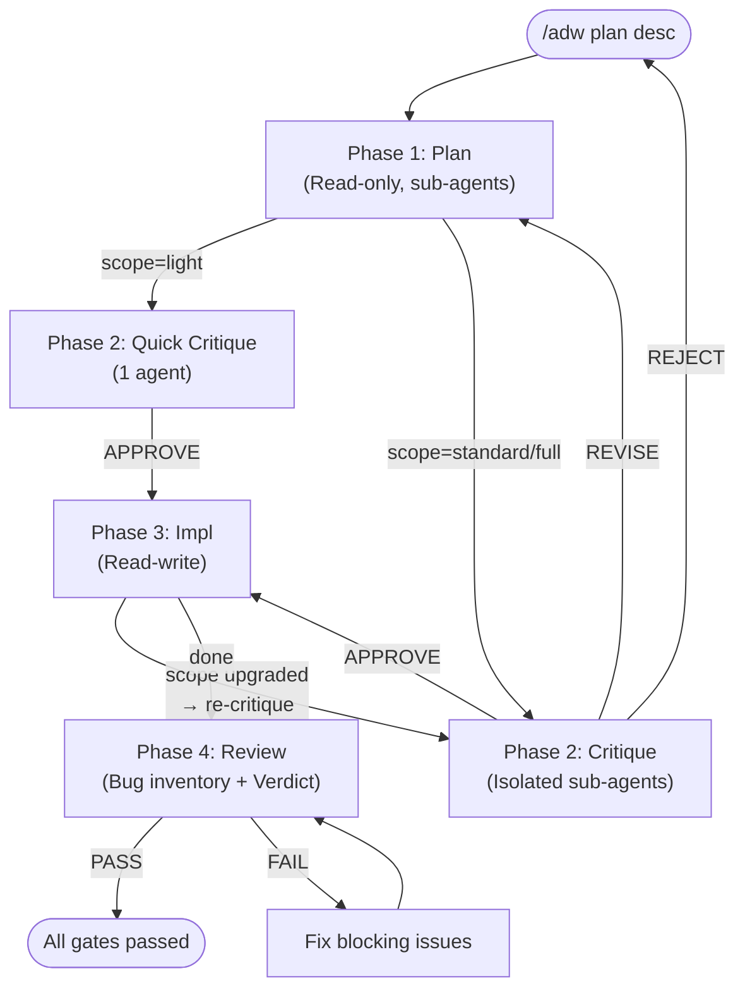

# Adversarial Dev Workflow

A structured development workflow for [Claude Code](https://claude.com/claude-code) that uses adversarial quality gates to catch real problems before they reach production.

**One command: `/adw`** — guides you through planning, critique, implementation, and review.

## Why Adversarial?

Two mechanisms work together:

1. **Adversarial prompting** — Instead of "is my code good?", the workflow asks "find every reason to reject it." This breaks the LLM's natural compliance bias.
2. **Context isolation** — Sub-agents receive only the artifact (plan or diff), not the reasoning behind it. This breaks anchoring bias and enables genuine critique.

Neither is sufficient alone: an adversary needs both the motivation to criticize AND a genuinely different perspective.

## The 4 Phases



| Phase | What it does | Mode |
|-------|-------------|------|
| **1. Plan** | Architecture, edge cases, risks, test strategy, invariants | Read-only |
| **2. Critique** | Adversarial review of the plan — break assumptions, find omissions | Read-only |
| **3. Impl** | Strict implementation following the plan checklist, tests alongside code | Read-write |
| **4. Review** | Adversarial code review: bug inventory + mandatory checklist + PASS/FAIL verdict | Read-only |

If review verdict is FAIL, fix blocking issues and re-run `/adw review` until PASS.

## Is it worth the overhead?

Yes, it costs more tokens than one-shot coding. But scope "light" adds near-zero overhead for small changes, every edge case caught before production pays back the cost, and state persistence means interrupted sessions lose no progress.

## Quick Start

```bash
# Clone the repo
git clone <repo-url> adversarial-dev-workflow
cd adversarial-dev-workflow

# Install the skill
./install.sh

# Go to any project and start
cd ~/my-project
# Guided mode:
/adw
# Or direct:
/adw plan implement user authentication with OAuth2
```

## Commands

| Command | Description |
|---------|-------------|
| `/adw` | Guided mode — detects state and proposes next phase |
| `/adw plan <desc>` | Phase 1 — Create an implementation plan |
| `/adw critique` | Phase 2 — Adversarial critique of the plan |
| `/adw impl` | Phase 3 — Guided implementation |
| `/adw review` | Phase 4 — Adversarial code review |
| `/adw status` | Display current workflow state (no action) |
| `/adw clean` | Delete workflow state for current project |

## Scope Adaptation

The workflow adapts its depth to the size of the task:

| Scope | Criteria | Critique | Review |
|-------|----------|----------|--------|
| **light** | 1-3 files, localized, no public API change | 1 agent, ~20 lines | 1 agent, ~30 lines |
| **standard** | 4-15 files, cross-dependencies | 2 agents, ~50 lines | 2 agents, ~80 lines |
| **full** | 15+ files, architecture impact, security critical | 3 agents, ~100 lines | 3 agents, ~150 lines |

Scope is estimated by exploration agents in Phase 1 (it's a heuristic, not an exact count). If the actual scope diverges during implementation, the workflow proposes an upgrade and re-critique.

## State Persistence

Workflow state is stored in `~/.adw/{project-name}/`:

```
~/.adw/my-project/
├── state.json      # Current phase, scope, progress tracking
├── plan.md         # The plan (immutable after creation)
├── critique.md     # Critique results and verdict
└── review.md       # Review findings and verdict
```

`{project-name}` is the basename of your working directory. State survives context window limits and session changes — run `/adw` to pick up where you left off.

## Uninstall

```bash
cd adversarial-dev-workflow
./uninstall.sh
```

This removes the skill symlink. Your workflow state in `~/.adw/` is preserved — remove it with `rm -rf ~/.adw/` if desired.

## Requirements

- [Claude Code](https://claude.com/claude-code)
- A git repository (required for diff tracking in review phase)
