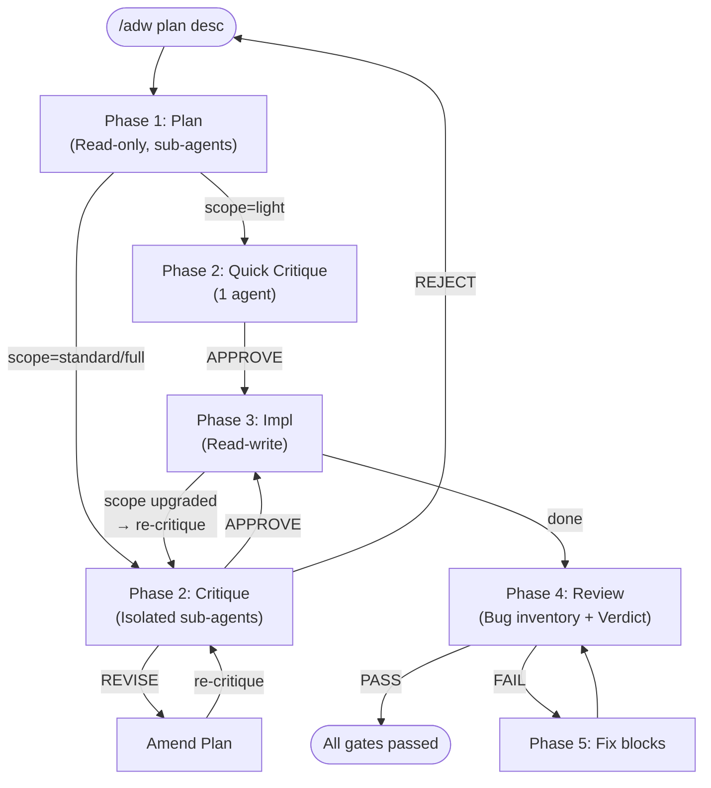

# Adversarial Dev Workflow

A structured development workflow for [Claude Code](https://claude.com/claude-code) that uses adversarial quality gates to catch real problems before they reach production.

**One command: `/adw`** — guides you through planning, critique, implementation, and review.

## Why Adversarial?

This workflow combines two distinct mechanisms that reinforce each other:

### 1. Adversarial prompting — breaks compliance bias

Instead of asking the AI "is my code good?", you ask it "find every reason to reject it." LLMs have a natural compliance bias — they tend to validate rather than challenge. By explicitly assigning the role of critic/adversary, we break this bias and get genuinely honest feedback.

However, the same model critiquing its own output still shares its blind spots — it cannot find flaws in categories of problems it doesn't recognize.

### 2. Context isolation — breaks anchoring bias

If the reviewer has seen the reasoning behind a plan, they're unconsciously anchored to it — they look for confirmations rather than flaws. By giving sub-agents ONLY the artifact (the plan, the code diff) without any "why" behind the decisions, they're free to question everything.

This is why the workflow persists artifacts to disk and sub-agents read from files — not from conversation context. The less context the agent has about the original reasoning, the more effective its critique.

### The two together

An adversary with both the **motivation to criticize** (adversarial prompting) AND a **genuinely different perspective** (context isolation). That's the difference between a superficial critique and one that finds real problems.

## The 5 Phases



| Phase | What it does | Mode |
|-------|-------------|------|
| **1. Plan** | Architecture, edge cases, risks, test strategy, invariants | Read-only |
| **2. Critique** | Adversarial review of the plan — break assumptions, find omissions | Read-only |
| **3. Impl** | Strict implementation following the plan checklist, tests alongside code | Read-write |
| **4. Review** | Adversarial code review: bug inventory + mandatory checklist + verdict | Read-only |
| **5. Patch** | Fix blocking issues from review, then re-review until PASS | Read-write |

## Is it worth the overhead?

**Honest answer: yes, it costs more tokens and is slower than one-shot coding.** No pretending otherwise.

But consider:

- **Scope "light"** exists for small changes — 1 agent, ~20-line critique. Almost zero overhead.
- **The real math**: How many times have you had to revisit a change because you missed an edge case, or because the initial architecture didn't hold? Every fix-review loop avoided in production pays back the workflow cost several times over.
- **Interruption-resistant**: State is persisted to disk (`~/.adw/`). If Claude Code hits its context limit, or you take a break, nothing is lost. Run `/adw` to pick up exactly where you left off. What looks like an overhead (it's slow) is actually a feature (it survives interruptions).

## Quick Start

```bash
# Clone the repo
git clone <repo-url> adversarial-dev-workflow
cd adversarial-dev-workflow

# Install the skill
./install.sh

# Go to any project and start
cd ~/my-project
# Guided mode:
/adw
# Or direct:
/adw plan implement user authentication with OAuth2
```

## Commands

| Command | Description |
|---------|-------------|
| `/adw` | Guided mode — detects state and proposes next phase |
| `/adw plan <desc>` | Phase 1 — Create an implementation plan |
| `/adw critique` | Phase 2 — Adversarial critique of the plan |
| `/adw impl` | Phase 3 — Guided implementation |
| `/adw review` | Phase 4 — Adversarial code review |
| `/adw status` | Display current workflow state (no action) |
| `/adw clean` | Delete workflow state for current project |

## Scope Adaptation

The workflow adapts its depth to the size of the task:

| Scope | Criteria | Critique | Review |
|-------|----------|----------|--------|
| **light** | 1-3 files, localized, no public API change | 1 agent, ~20 lines | 1 agent, ~30 lines |
| **standard** | 4-15 files, cross-dependencies | 2 agents, ~50 lines | 2 agents, ~80 lines |
| **full** | 15+ files, architecture impact, security critical | 3 agents, ~100 lines | 3 agents, ~150 lines |

Scope is estimated by exploration agents in Phase 1 (it's a heuristic, not an exact count). If the actual scope diverges during implementation, the workflow proposes an upgrade and re-critique.

## State Persistence

Workflow state is stored in `~/.adw/{project-name}/`:

```
~/.adw/my-project/
├── state.json      # Current phase, scope, progress tracking
├── plan.md         # The plan (immutable after creation)
├── critique.md     # Critique results and verdict
└── review.md       # Review findings and verdict
```

- **`{project-name}`** is the basename of your working directory
- State survives context window limits and session changes
- `/adw` (guided mode) reads state to propose the next step
- `/adw status` shows state without taking action
- `/adw clean` removes state for the current project

## Uninstall

```bash
cd adversarial-dev-workflow
./uninstall.sh
```

This removes the skill symlink. Your workflow state in `~/.adw/` is preserved — use `/adw clean` per project before uninstalling, or `rm -rf ~/.adw/` to remove everything.

## Requirements

- [Claude Code](https://claude.com/claude-code)
- A git repository (required for diff tracking in review phase)
